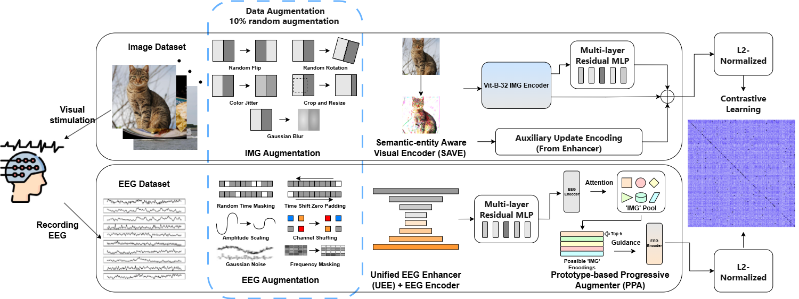

# SUP-MCRL: Subject-aware Unified Pseudo-feature Coded Multimodal Contrastive Representation Learning for EEG Visual Decoding

A contrastive learning-based framework for EEG-image cross-modal alignment and retrieval. Designed for the **THINGS-EEG** dataset, this project achieves precise retrieval from EEG signals to visual stimulus images through multi-scale time-frequency encoding, hierarchical image codebooks, subject extraction enhancement, and learnable-temperature InfoNCE loss.

---

## Table of Contents
- [Overview](#overview)
- [Architecture](#architecture)
- [File Structure](#file-structure)
- [Requirements](#requirements)
- [Data Preparation](#data-preparation)
- [Quick Start](#quick-start)
  - [Training](#training)
  - [Evaluation](#evaluation)
- [Training Modes](#training-modes)
- [Key Hyperparameters](#key-hyperparameters)
- [Module Quick Preview](#module-quick-preview)
- [Logging & Visualization](#logging--visualization)
- [Citation](#citation)
- [License](#license)

---

## Overview

**SUP-MCRL** (Subject-aware Unified Pseudo-feature Coded Multimodal Contrastive Representation Learning) addresses cross-modal representation alignment between EEG signals and images. Core designs include:

- **Unified EEG Enhancer (UEE)**: Combines channel-temporal purification (PIES), multi-band frequency convolution, and temporal multi-scale dilated convolution to extract robust neural representations.
- **Subject-Aware Visual Enhancement (SAVE)**: Enhances subject regions in images while suppressing background interference via multi-scale sparse dilated convolution and hard attention mechanisms.
- **Prototype-guided Progressive Alignment (PPA)**: Constructs a three-layer learnable codebook (EMA update + expert routing), using image features to guide EEG representation enhancement during training, while enabling pure EEG-driven retrieval during testing.
- **Robust Projection Heads**: Residual projection networks of different depths for EEG and image modalities, supplemented with feature space augmentation.
- **Adaptive InfoNCE Loss**: Introduces learnable temperature parameters, hard negative weighting, and supervised contrastive loss to stabilize training and improve intra-class clustering.

---

## Architecture



The framework follows a **dual-encoder structure with unidirectional feature enhancement**. EEG and image modalities are processed through separate pathways, aligned in a shared L2-normalized embedding space, and optimized via a temperature-adaptive InfoNCE objective.

---

### Data Flow Overview

#### EEG Pathway
1. **Input**: Raw EEG signals `[B, C, T]`
2. **UEE EEG Encoder** (`UEE_EEG_ENCODER.py`)
   - Positional encoding (temporal + spatial sinusoidal)
   - PIES purification (channel × temporal gating)
   - Multi-band frequency convolution (δ/θ/α/β/γ)
   - Temporal multi-scale dilated convolution + self-attention
3. **Robust Projection Head** (`basic_model.py`)
   - Input LayerNorm → 5-layer residual MLP (expansion=3, SiLU, dropout=0.3)
4. **PPA Module** (`PPA.py`) — `EEGToImageAttention`
   - Hierarchical image codebook querying (3 layers)
   - Cross-scale refinement blocks
   - Training: image-guided fusion; Inference: pure EEG-driven retrieval
5. **Output**: Subject-invariant EEG representation `[B, 512]`

#### Image Pathway
1. **Input**: Visual stimuli `[B, 3, H, W]`
2. **SAVE Module** (`SAVE.py`) — Subject-Aware Visual Enhancement
   - Multi-scale sparse dilated convolution encoder
   - Center-prior spatial decoder (Gaussian warmup)
   - Hard attention: subject enhancement (>1.0) + background suppression (<1.0)
3. **CLIP Visual Encoder** (`basic_model.py`) — Frozen ViT-B/32
   - Extracts base visual features `[B, 512]`
4. **Robust Projection Head** (`basic_model.py`)
   - Input LayerNorm → 5-layer residual MLP (expansion=2, dropout=0.15)
5. **Output**: Subject-enhanced image representation `[B, 512]`

---

### Cross-Modal Alignment

| Phase | EEG Branch | Image Branch | Interaction |
|-------|-----------|--------------|-------------|
| **Training** | EEG query → `ImageCodebook` (PPA) | SAVE-enhanced → CLIP features | PPA fuses EEG codebook output with image guidance (`img_guidance_ratio=0.3`) via adaptive fusion gate |
| **Inference** | EEG query → `ImageCodebook` (PPA) | Direct CLIP + SAVE features | Image guidance disabled (`img_feat=None`); pure EEG-driven retrieval |

---

### Component Specifications

| Module | Source File | Key Operations | Output Dimensions |
|--------|-------------|----------------|-------------------|
| **UEE** | `UEE_EEG_ENCODER.py` | PIES, `ImprovedFrequencyConv`, `TimeDomainMultiScaleConv`, `MultiResolutionFusion` | `[B, 512]` |
| **SAVE** | `SAVE.py` | `LightweightMultiScaleEncoder`, `MultiScaleSpatialDecoder`, `CenterPriorModule`, hard attention | Visual: `[B, 3, H, W]`, Feature: `[B, 512]` |
| **PPA** | `PPA.py` | 3-layer codebook (64/128/320 codewords), EMA update, expert routing, cross-attention | `[B, 512]` |
| **Projection** | `basic_model.py` | `RobustProjectionHead` (depth=5, SiLU, LayerNorm, residual blocks) | `[B, 512]` |
| **Loss** | `loss.py` | Learnable temperature, hard negative weighting, supervised contrastive loss | Scalar |

---

### Feature Enhancement Detail

The **PPA module** operates differently across phases:

- **Training Phase**: `EEGToImageAttention` uses the image codebook output as a guidance target. A learnable fusion gate (`fusion_gate`) adaptively mixes EEG codebook features with image-derived pseudo-features, enabling semantic alignment while preserving EEG identity.
- **Testing Phase**: Image guidance is explicitly disabled (`img_feat=None`). The module performs pure EEG-to-codebook retrieval, ensuring the model relies solely on neural signals for visual decoding.

Both pathways apply **Feature Space Augmentation** during training (adaptive Gaussian noise, random scaling, feature dropout with re-L2-normalization) and a final **L2 normalization** before contrastive learning.

---

## File Structure

```
.
├── basic_model.py           # Main model EmotionAligner: end-to-end network integrating all modules
├── UEE_EEG_ENCODER.py       # EEG encoder: PIES, frequency/temporal convolution, multi-resolution fusion
├── PPA.py                   # Image codebook and EEG→Image unidirectional attention mechanism
├── SAVE.py                  # Image subject extraction network (multi-scale sparse dilated convolution)
├── data_augmentation.py     # Data augmentation for EEG, images, and feature space
├── data_perprocessing.py    # THINGS-EEG data loading and global caching
├── loss.py                  # InfoNCE loss (learnable temperature, hard negatives, supervised contrastive)
└── train.py                 # Training script: supports intra / loso / inter_mix modes
```

---

## Requirements

- Python >= 3.8
- PyTorch >= 1.12
- torchvision
- CLIP (`pip install git+https://github.com/openai/CLIP.git`)
- NumPy, Pillow, tqdm, matplotlib, seaborn

> **Note**: The CLIP model path in the code is a local path `"!!!Your Path!!!" + "/clip_model/ViT-B-32.pt"`. Please modify `clip_model_name` in `basic_model.py` according to your actual setup.

---

## Data Preparation

This project uses the **THINGS-EEG** dataset (250Hz preprocessed version). Please organize your data according to the following directory structure:

```
dataset_Things_eeg/
├── Image_set/
│   ├── training_images/
│   │   └── 1_aardvark/
│   │       ├── 1a.jpg, 1b.jpg, ...
│   └── test_images/
│       └── ...
└── Preprocessed_data_250Hz/
    ├── sub-01/
    │   ├── preprocessed_eeg_training.npy
    │   └── preprocessed_eeg_test.npy
    ├── sub-02/
    └── ...
```

### Data Preprocessing

The data preprocessing pipeline follows the methodology described in:

> **Neural-MCRL: Neural Multimodal Contrastive Representation Learning for EEG-based Visual Decoding**  
> Yueyang Li, Zijian Kang, Shengyu Gong, Wenhao Dong, Weiming Zeng, Hongjie Yan, Wai Ting Siok, Nizhuan Wang  
> *2025 IEEE International Conference on Multimedia and Expo (ICME)*, 2025, pp. 1-6.

```bibtex
@INPROCEEDINGS{11210130,
  author={Li, Yueyang and Kang, Zijian and Gong, Shengyu and Dong, Wenhao and Zeng, Weiming and Yan, Hongjie and Siok, Wai Ting and Wang, Nizhuan},
  booktitle={2025 IEEE International Conference on Multimedia and Expo (ICME)}, 
  title={Neural-MCRL: Neural Multimodal Contrastive Representation Learning for EEG-based Visual Decoding}, 
  year={2025},
  volume={},
  number={},
  pages={1-6},
  keywords={Representation learning;Visualization;Electrical impedance tomography;Electric potential;Accuracy;Semantics;Solids;Electroencephalography;Brain-computer interfaces;Decoding;EEG-based visual decoding;Multimodal contrastive representation learning;Semantic consistency and completion;Multimodal semantic alignment},
  doi={10.1109/ICME59968.2025.11210130}
}
```

Please refer to the above paper for detailed preprocessing procedures. In brief, the EEG data undergoes band-pass filtering, artifact removal, and segmentation aligned with image presentation timestamps. The image data is organized by semantic categories with natural sorting for consistent pairing.

Modify the path variables at the top of `data_perprocessing.py`:

```python
IMG_ROOT = "Your_Path/dataset_Things_eeg/Image_set"
EEG_ROOT = "Your_Path/dataset_Things_eeg/Preprocessed_data_250Hz"
```

---

## Quick Start

### Training

#### 1. Intra-subject Training
```bash
python train.py --mode intra --sub 1 --epochs 50 --lr 1e-2 --batch_size 32
```

#### 2. Leave-One-Subject-Out (LOSO)
```bash
python train.py --mode loso --sub 1 --epochs 50 --lr 1e-2 --batch_size 32
```
> Subject 1 as test set, remaining subjects 2-10 as training set.

#### 3. Inter-subject Mixed Training
```bash
python train.py --mode inter_mix --epochs 50 --lr 1e-2 --batch_size 32
```
> All 10 subjects mixed for training, no independent validation subject.

### Evaluation

The training script includes built-in **N-way Top-K** evaluation (10/50/100/200-way), executed automatically per validation epoch. Additionally, **EEG-Image similarity heatmaps** are supported:

- Validation results automatically output `top-1` and `top-5` accuracy.
- Heatmaps saved to `./heatmap/heatmap_fold_{idx}_{timestamp}.png`.

---

## Training Modes

| Mode | Description | Training Subjects | Validation Subjects |
|------|-------------|-------------------|---------------------|
| `intra` | Single-subject independent training | Specified by `--sub` | Same subject test set |
| `loso` | Leave-one-subject-out cross-validation | 1-10 excluding `--sub` | Specified by `--sub` |
| `inter_mix` | All-subjects mixed training | All 1-10 | Mixed test sets from same subjects |

---

## Key Hyperparameters

| Parameter | Default | Description |
|-----------|---------|-------------|
| `--lr` | `1e-2` | Main learning rate |
| `--init_temp` | `0.07` | Initial temperature (CLIP-style) |
| `--temp_lr_ratio` | `0.5` | Temperature parameter LR ratio relative to main LR |
| `--lambda_sup` | `0.5` | Supervised contrastive loss weight |
| `--hard_negative_weight` | `1.0` | Hard negative weighting coefficient |
| `--batch_size` | `32` | Batch size |
| `--patience` | `0` | Early stopping patience (0 to disable) |

---

## Module Quick Preview

### 1. UEE_EEG_ENCODER.py — EEG Encoder
- **PositionalEncoding**: Temporal + spatial sinusoidal positional encoding.
- **PIES (Purified Instance Enhancement)**: Channel gating × temporal gating, jointly purifying noise while preserving effective neural signals.
- **ImprovedFrequencyConv**: Parallel convolution based on δ/θ/α/β/γ bands + cross-band attention fusion.
- **TimeDomainMultiScaleConv**: Pyramid downsampling → multi-resolution fusion → ASPP multi-scale dilated convolution → temporal self-attention.
- **AdaptiveInstanceNorm**: Per-sample channel statistics normalization, adapting to non-stationary EEG characteristics.

### 2. SAVE.py — Image Subject Extraction
- **LightweightMultiScaleEncoder**: 4-level downsampling + multi-scale sparse dilated convolution (adaptive weight fusion).
- **MultiScaleSpatialDecoder**: Skip-connection upsampling, outputting 3-channel independent weight logits.
- **CenterPriorModule**: Gaussian center prior guiding subject localization.
- **Hard Attention Mechanism**: Pushes weights toward binarization via learnable temperature, achieving `subject enhancement (>1.0)` and `background suppression (<1.0)`.

### 3. PPA.py — Hierarchical Codebook & Unidirectional Attention
- **ImageCodebook**:
  - Three-layer codebook (L1: 64, L2: 128, L3: 320), each with independent residual gating.
  - Expert routing restricting search space.
  - EMA-updated codebook ensuring training stability.
  - Spherical uniform initialization + lightweight repulsion optimization.
- **EEGToImageAttention**:
  - Training: Introduces image codebook output as fusion target with probability `img_guidance_ratio`, adaptively mixed via gating network.
  - Testing: Purely EEG-query based codebook retrieval, achieving unidirectional enhancement.
  - Unified L2 normalization output.

### 4. data_augmentation.py — Data Augmentation
- **EEGAugmentation**: Temporal jitter, amplitude scaling, random channel dropout/shuffle, Gaussian noise, frequency band masking.
- **ImageAugmentation**: Random flip, rotation (±10°), color jitter, random crop, Gaussian blur.
- **FeatureSpaceAugmentation**: Applies adaptive Gaussian noise, random scaling, and feature dimension dropout on projection head outputs, with re-L2 normalization.

### 5. loss.py — InfoNCE Loss
- **Learnable Temperature**: Parameterized as `logit_scale = exp(logit_scale_param)`, temperature `τ = 1/logit_scale`, with upper bound to prevent divergence.
- **Hard Negative Weighting**: Dynamically weights samples by difficulty (loss value), focusing on hard examples.
- **Supervised Contrastive Loss**: Utilizes category labels to pull same-class samples together and push different-class samples apart.

### 6. train.py — Training & Evaluation
- **Global Caching**: Images cached globally by split to avoid repeated IO; EEG loaded on-demand by subject.
- **EEGImagePairDataset**: Supports multi-subject EEG mapping to shared image data, avoiding image memory copies through index mapping.
- **validate_model**: Performs `N_WAY_EVAL_ROUNDS` random negative sampling evaluations, outputting Top-1 / Top-5 mean and standard deviation.
- **validate_model_heatmap**: Generates EEG-Image similarity heatmaps (white→blue colormap), with diagonal highlighting.
- **Best Model Saving Strategy**: Saves optimal checkpoints by priority `Top-1 > Top-5 > Train Loss`.

---

## Logging & Visualization

- Logs output via `logger` module, including loss, temperature `τ`, gradient norms, Top-K accuracy, etc.
- Heatmaps saved to `./heatmap/`, naming format: `heatmap_fold_{fold_idx}_{timestamp}.png`.
- Model checkpoints saved to `./model/`, naming format: `{timestamp}_fold{idx}.pth`.

---

## Citation

If you use this project in your research, please consider citing:

```bibtex
@article{supmcrl2024,
  title={SUP-MCRL: Subject-aware Unified Pseudo-feature Coded Multimodal Contrastive Representation Learning for EEG Visual Decoding},
  author={Your Name},
  year={2024}
}
```

And the preprocessing reference:

```bibtex
@INPROCEEDINGS{11210130,
  author={Li, Yueyang and Kang, Zijian and Gong, Shengyu and Dong, Wenhao and Zeng, Weiming and Yan, Hongjie and Siok, Wai Ting and Wang, Nizhuan},
  booktitle={2025 IEEE International Conference on Multimedia and Expo (ICME)}, 
  title={Neural-MCRL: Neural Multimodal Contrastive Representation Learning for EEG-based Visual Decoding}, 
  year={2025},
  volume={},
  number={},
  pages={1-6},
  keywords={Representation learning;Visualization;Electrical impedance tomography;Electric potential;Accuracy;Semantics;Solids;Electroencephalography;Brain-computer interfaces;Decoding;EEG-based visual decoding;Multimodal contrastive representation learning;Semantic consistency and completion;Multimodal semantic alignment},
  doi={10.1109/ICME59968.2025.11210130}
}
```

---

## License

This project is for academic research purposes only. The code uses the OpenAI CLIP model; please follow its corresponding license.

---

## Configuration Notes

### CLIP Model Path

Set the CLIP model path in `basic_model.py`:

```python
self.clip_model_name = "!!!Your Path!!!" + "/clip_model/ViT-B-32.pt"
```

Please replace `"!!!Your Path!!!"` with your actual root directory path.

### Data Paths

Set data root directories in `data_perprocessing.py`:

```python
IMG_ROOT = "!!!Your Path!!!" + "/dataset_Things_eeg/Image_set"
EEG_ROOT = "!!!Your Path!!!" + "/dataset_Things_eeg/Preprocessed_data_250Hz"
```

Similarly, replace `"!!!Your Path!!!"` with your actual data storage path.
